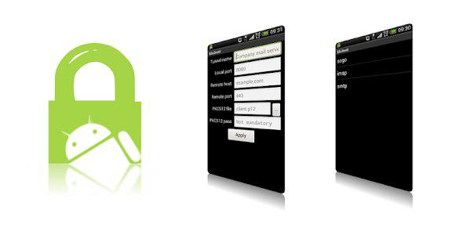
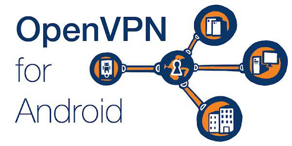

# Setup OpenVPN over Stunnel on Linux

I used below software and OS:

Ubuntu 22.04.5 LTS (Jammy Jellyfish).

| Software  | Version  |
|-----------|----------|
| squid     | 5.9      |
| stunnel   | 5.75     |
| openvpn   | 2.5.11   |
| easy-rsa  | 3.0.8    |

## Server Side Configuration

Create your own VPS from the cloud vendors, such like: Linode, GCP, Vultr, Digital Ocean or Azure...

Recently I found some cheaper VPS vendors: raksmart, racknerd, buyvm, cloudcone.

### Overview


* All network traffic through the SSL tunnel (stunnel).
* It provide client side applications multiple choice to access the internet through HTTP(S) proxy, SOCKS5 proxy or VPN.

### Install Software

```bash
sudo -s
apt install build-essential libssl-dev squid openvpn easy-rsa
```

### Build stunnel from source files.

```bash
wget https://www.stunnel.org/downloads/stunnel-5.75.tar.gz
wget https://www.stunnel.org/downloads/stunnel-5.75.tar.gz.sha256
sha256sum --check stunnel-5.75.tar.gz.sha256
tar xvf stunnel-5.75.tar.gz
cd stunnel-5.75
./configure
make
make install
```

### Configure Stunnel

```bash
# Change to tools directory under stunnel
cd tools

# Generate certificate
./makecert.sh

# Copy certificate to stunnel config directory
cp stunnel.pem /usr/local/etc/stunnel/

# Copy systemd service file
cp stunnel.service /etc/systemd/system/

# Change to stunnel config directory
cd /usr/local/etc/stunnel

# Edit stunnel.conf
# Copy the content of stunnel-server.conf from this repository
vi stunnel.conf

# Create stunnel user
useradd -s /bin/false -r stunnel

# Create stunnel runtime directory
mkdir /var/lib/stunnel

# Set ownership for stunnel directory
chown stunnel:stunnel /var/lib/stunnel

# Reload systemd daemon
systemctl daemon-reload

# Enable stunnel service
systemctl enable stunnel

# Start stunnel service
systemctl start stunnel
```

### Add iptables rules

```bash
# Allow incoming TCP traffic on ports 443, 7777, and 7788
iptables -A INPUT -p tcp --dport 443 -j ACCEPT
iptables -A INPUT -p tcp --dport 7777 -j ACCEPT
iptables -A INPUT -p tcp --dport 7788 -j ACCEPT

# Save iptables rules permanently
apt install iptables-persistent
```

### Configure OpenVPN

```bash
cd /etc/openvpn
make-cadir easy-rsa
cd easy-rsa
./easyrsa clean-all
./easyrsa build-ca
./easyrsa build-server-full server
./easyrsa build-client-full client
./easyrsa gen-dh

cd /etc/openvpn

# Write the password of the server key in this file. It will be used in server.conf.
vi pass

# Copy the content of openvpn-server.conf from this repository, replace <server-address> with your VPS IP address.
vi server.conf

systemctl restart OpenVPN

# Uncomment the line: net.ipv4.ip_forward=1
vi /etc/sysctl.conf

sysctl -p

```

### Add iptables rules

```bash
# Check network interface name. If it is not eth0 then replace eth0 with it in below command.
ip a

iptables -t nat -A POSTROUTING -s 10.8.0.0/24 -o eth0 -j MASQUERADE

# Save iptables rules permanently
netfilter-persistent save
```

### Reboot

Every time the system restarted, if the iptables-persistent doesn't work, execute below commands manually:

```bash
# Allow incoming TCP traffic on ports 443, 7777, and 7788
sudo iptables -A INPUT -p tcp --dport 443 -j ACCEPT
sudo iptables -A INPUT -p tcp --dport 7777 -j ACCEPT
sudo iptables -A INPUT -p tcp --dport 7788 -j ACCEPT

# Enable NAT for VPN subnet (replace eth0 with your network interface name if different)
sudo iptables -t nat -A POSTROUTING -s 10.8.0.0/24 -o eth0 -j MASQUERADE

# View current firewall rules
sudo iptables -L
sudo iptables -t nat -L
```

---

## Client Side Configuration

Stunnel is required. OpenVPN is optional.

### Install Stunnel

- Ubuntu

    Build from source files as on the server.

- Mac

```bash
brew install stunnel
```

- Windows

    Download the installer from https://www.stunnel.org
    
- Android

    ~~  
        Install `SSLDroid` from Google Play Store https://play.google.com/store/apps/details?id=hu.blint.ssldroid~~

    It' too bad that the SSLDroid is disappeared from Google Play Store. So you need to search and download the apk file by yourself and install it on your android phone manually.

### Configure Stunnel

- Ubuntu

    1. Copy ``/usr/local/etc/stunnel/stunnel.pem`` from your VPS to the same place on your client machine.
    2. Copy ``stunnel-client.conf`` from this repository to ```/usr/local/etc/stunnel``` directory on your client machine.
    3. Replace <server-address> with your VPS IP address in stunnel-client.conf.
    4. Restart stunnel ``sudo systemctl restart stunnel``

- Mac

    1. Copy ``/usr/local/etc/stunnel/stunnel.pem`` from your VPS to the same place on your Mac.
    2. Copy ``stunnel-client.conf`` from this repository to the same place on your Mac.
    3. Replace <server-address> with your VPS IP address in stunnel-client.conf.
    4. To start the stunnel, open a terminal and run command ``stunnel``.

- Windows
  
    1. Copy ``/usr/local/etc/stunnel/stunnel.pem`` from your VPS to your Windows machine.
    2. Launch stunnel from Windows start menu.
    3. Open stunnel application window, select edit configuration menu item.
    4. Copy the content of ``stunnel-client.conf`` from this repository to the edit window.
    5. Modify the cert path and replace <server-address> with your VPS IP address.
    6. Save it.

- Android

    1. Convert the stunnel.pem to PKCS12 format to be used in SSLDroid with below command.

        ```openssl pkcs12 -export -out stunnel.p12 -in stunnel.pem```
    2. Copy stunnel.p12 to your android phone.
    3. Launch SSLDroid on your android phone, add a tunnel following the GUI.

### Install OpenVPN

- Ubuntu
  
    `sudo apt install openvpn`

- Mac

    Download ``tunnelblick`` from https://tunnelblick.net

- Windows

    Download the setup program from https://openvpn.net/community-downloads
    
- Android

      
    Install `OpenVPN for Android` from Google Play Store https://play.google.com/store/apps/details?id=de.blinkt.openvpn


### Configure OpenVPN

- Ubuntu

    1. Download ``openvpn-client.ovpn`` from this github repository.
    2. Edit the file.
       - Replace ``<server-address>`` with your VPS address.
       - Follow the comments in the content, copy/paste the content of the CA certificate, client certificate and key content from your VPS.
    3. For Ubuntu 1804, you need to fix the DNS leak.
       - `sudo apt install openvpn-systemd-resolved`
       - Copy below block to ``openvpn-client.ovpn``
```
                script-security 2
                up /etc/openvpn/update-systemd-resolved
                down /etc/openvpn/update-systemd-resolved
                down-pre
                dhcp-option DNSSEC allow-downgrade
                dhcp-option DOMAIN_ROUTE .
```
   To start the openvpn, run `sudo openvpn --config <path>/openvpn-client.ovpn`

- Mac

    1. Download ``openvpn-client.ovpn`` from this github repository.
    2. Edit the file.
       - Replace ``<server-address>`` with your VPS address.
       - Follow the comments in the content, copy/paste the content of the CA certificate, client certificate and key content from your VPS.
    3. Launch ``tunnelblick``, import ``openvpn-client.ovpn``

- Windows

    1. Download ``openvpn-client.ovpn`` from this github repository.
    2. Edit the file.
       - Replace ``<server-address>`` with your VPS address.
       - Follow the comments in the content, copy/paste the content of the CA certificate, client certificate and key content from your VPS.
    3. Launch OpenVPN GUI, import ``openvpn-client.ovpn``

- Android

    1. You must exclude the `SSLDroid` bypass the VPN in the OpenVPN settings. It is because the OpenVPN traffic need to pass via the stunnel.
