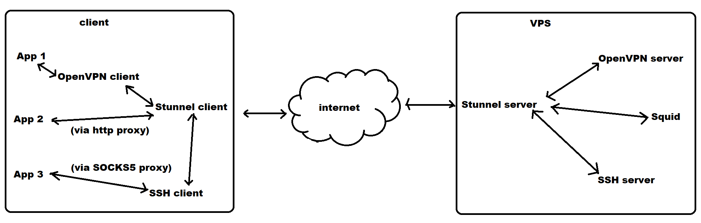

# Chapter 1 Server Side Configuration

Create your own VPS from Linode, GCP, Vultr, Digital Ocean or Azure. I haven't tried AWS. 

Choose the operating system Ubuntu.

This guide help you setup two ways to safe surf the internet, proxy and VPN.

Both ways are good.

The proxy way gives you more options than VPN. You can make the proxy system-wide or just for individual app.

## Overview



* All network traffic through the stunnel (a SSL proxy).
* Provide client side applications multiple choice to access the internet via HTTP(S) proxy, SOCKS5 proxy or VPN.

## Install Software

1. `sudo apt install squid3 stunnel4 openvpn easy-rsa`
2. `sudo -s`

## Configure Stunnel

3. `cd /etc/stunnel`
4. `openssl genrsa -out key.pem 2048`
5. `openssl req -new -x509 -key key.pem -out cert.pem -days 3650`  
> **Set Common Name to your vps public IP or domain name**
6. `cat key.pem cert.pem >> stunnel.pem`
7. `openssl pkcs12 -export -out stunnel.p12 -inkey key.pem -in cert.pem`
8. `vi stunnel.conf`  
> **Copy the content of stunnel-server.conf**
9. `vi /etc/default/stunnel4`  
> **change the enabled line to 1: ENABLED=1**
10. `service stunnel4 restart`
11. `iptables -A INPUT -p tcp --dport 443 -j ACCEPT`
12. `iptables -A INPUT -p tcp --dport 7777 -j ACCEPT`
13. `iptables -A INPUT -p tcp --dport 7788 -j ACCEPT`

## Configure OpenVPN

14.  `cd /etc/openvpn`
15.  `make-cadir easy-rsa`
16.  `cd easy-rsa`
17.  `cp openssl-1.0.0.cnf openssl.cnf`
18.  `source ./vars`
19.  `./clean-all`
20.  `./build-ca`
21.  `./build-key-server server`  
> **Set Common Name to your vps public IP or domain name**
22.  `./build-key client`
23. `./build-dh`
24. `cd ..`
25. `vi server.conf`  
> **Copy the content of openvpn-server.conf, replace ``<server-address>`` with your VPS IP address.**
26. `service openvpn restart`
27. `vi /etc/sysctl.conf`  
> **Uncomment the line: net.ipv4.ip_forward=1**
28. `sysctl -p`
29. `ifconfig`  
> **Check network interface name. Is it eth0?**
30. `iptables -t nat -A POSTROUTING -s 10.8.0.0/24 -o eth0 -j MASQUERADE`
31. `apt install iptables-persistent`

# Reboot

Each time after the system restarted, if the iptables-persistent doesn't work, execute below commands manually:

32. `sudo iptables -A INPUT -p tcp --dport 443 -j ACCEPT`
33. `sudo iptables -A INPUT -p tcp --dport 7777 -j ACCEPT`
34. `sudo iptables -A INPUT -p tcp --dport 7788 -j ACCEPT`
35. `sudo iptables -t nat -A POSTROUTING -s 10.8.0.0/24 -o eth0 -j MASQUERADE`

> Use commands `sudo iptables -L` and `sudo iptables -t nat -L` to see the firewall rules.

---

# Chapter 2 Client Side Configuration

Stunnel is required. OpenVPN is optional.

## Install Stunnel

- Ubuntu

    `sudo apt install stunnel4`

- Mac

    `brew install stunnel`

- Windows

    Download the setup program from https://www.stunnel.org
    
- Android

    Install `SSLDroid` from Google Play Store https://play.google.com/store/apps/details?id=hu.blint.ssldroid


## Configure Stunnel

- Ubuntu

    1. Copy ``/etc/stunnel/stunnel.pem`` from your VPS to the same folder on your client.
    2. Download ``stunnel-client.conf`` from this github repository.
    3. Copy it to ``/etc/stunnel`` folder.
    4. Modify ``/etc/default/stunnel4``  
    > set **ENABLED=1**
    5. Restart stunnel ``sudo service stunnel4 restart``

- Mac

    1. Copy ``/etc/stunnel/stunnel.pem`` from your VPS to ``/usr/local/etc/stunnel`` on your Mac.
    2. Download ``stunnel-client.conf`` from this github repository.
    3. Copy it to ``/usr/local/etc/stunnel`` folder.

    To start the stunnel, You need to open a terminal and run command ``stunnel``.

- Windows
  
    1. Copy ``/etc/stunnel/stunnel.pem`` from your VPS to ``C:\Program Files (x86)\stunnel\config`` on your Windows.
    2. Download ``stunnel-client.conf`` from this github repository.
    3. Copy it to ``C:\Program Files (x86)\stunnel\config`` folder.

- Android

    1. The PKCS12 file is the `stunnel.p12` generated from upon step 7.

## Install OpenVPN

- Ubuntu
  
    `sudo apt install openvpn`

- Mac

    Download ``tunnelblick`` from https://tunnelblick.net

- Windows

    Download the setup program from https://openvpn.net/community-downloads
    
- Android

    Install `OpenVPN for Android` from Google Play Store https://play.google.com/store/apps/details?id=de.blinkt.openvpn


## Configure OpenVPN

- Ubuntu

    1. Download ``openvpn-client.ovpn`` from this github repository.
    2. Edit the file.
       - Replace ``<server-address>`` with your VPS address.
       - Follow the comments in the content, copy/paste the content of the CA certificate, client certificate and key content from your VPS.
    3. For Ubuntu 1804, you need to fix the DNS leak.
       - `sudo apt install openvpn-systemd-resolved`
       - Copy below block to ``openvpn-client.ovpn``
```
                script-security 2
                up /etc/openvpn/update-systemd-resolved
                down /etc/openvpn/update-systemd-resolved
                down-pre
                dhcp-option DNSSEC allow-downgrade
                dhcp-option DOMAIN_ROUTE .
```
   To start the openvpn, run `sudo openvpn --config <path>/openvpn-client.ovpn`

- Mac

    1. Download ``openvpn-client.ovpn`` from this github repository.
    2. Edit the file.
       - Replace ``<server-address>`` with your VPS address.
       - Follow the comments in the content, copy/paste the content of the CA certificate, client certificate and key content from your VPS.
    3. Launch ``tunnelblick``, import ``openvpn-client.ovpn``

- Windows

    1. Download ``openvpn-client.ovpn`` from this github repository.
    2. Edit the file.
       - Replace ``<server-address>`` with your VPS address.
       - Follow the comments in the content, copy/paste the content of the CA certificate, client certificate and key content from your VPS.
    3. Launch OpenVPN GUI, import ``openvpn-client.ovpn``

- Android

    1. You must exclude the `SSLDroid` bypass the VPN in the OpenVPN settings. It is because the OpenVPN traffic need to pass via the stunnel.
